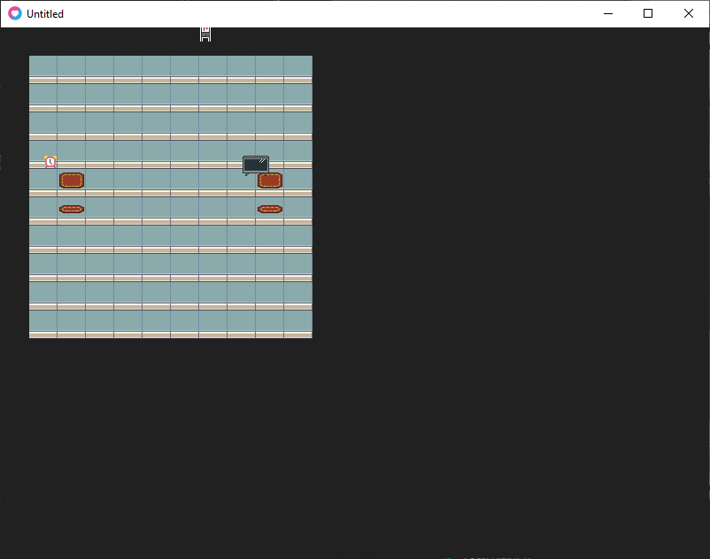
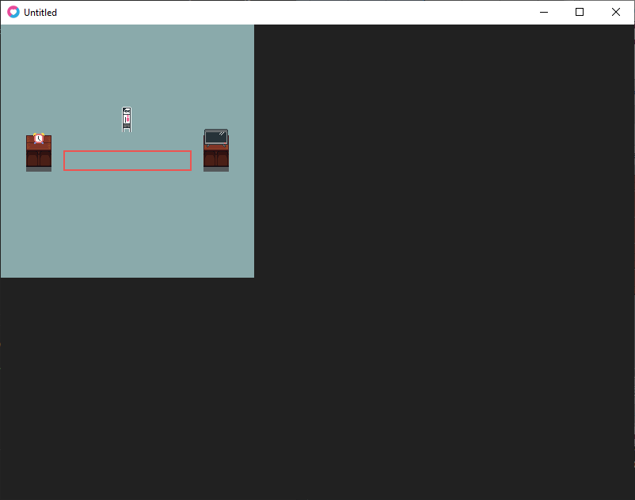
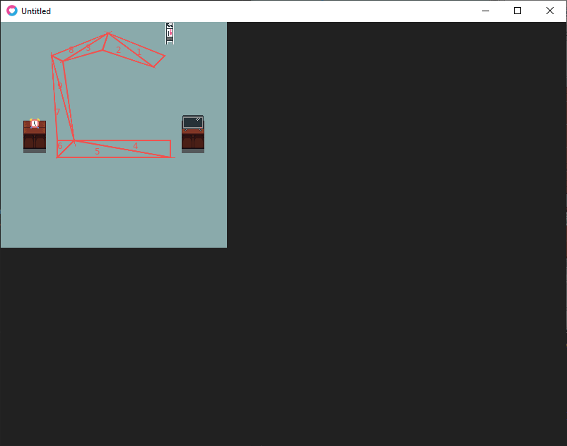

# Loading from Tiled

Tiled stores tilemaps in chunks and in a 1d array.

I had to convert a 1d array to a 2d array and combine all the chunks.

Turns out I needed to subtract one from the x and y values that determine the cell position of the tile and the frame of the texture used.

Tiled map loading works :). Those red X's are supposed to be the origin of the entity. Might need to check if the position is accurate later.

# Pathing

In the original version, I connected lines between appliances and NPCs would use Dijkstra to find a path to the appliance they want next.

For this version, I decided to explore navigation meshes. I found this [article](https://www.gamedev.net/articles/programming/artificial-intelligence/navigation-meshes-and-pathfinding-r4880/) explaining how to implement it. Here are the steps I'll take for the implementation:

1. Mark the house with a giant polygon that covers every walkable area.
2. Split the polygon(s) into triangles.
3. Use A\* to find the shortest path from the closest triangle to a person to the closest triangle of the target appliance.
4. Use a String Pulling Algorithm to find all triangle points to move to.
5. Move the person.

Loading a polygon from Tiled.

Triangulating that polygon. Original was going to use an archaic Delaunay library, but it turns out Love2D now has a triangulate() method!

Making a longer test path so I can really test the upcoming pathfinding.

# Conclusion

Love2D is still a fantastic framework for 2D games and I still like Lua as a language.

For pathing, I managed to finish the first 2 steps. Steps 3-5 are going to be the real meat of the programming.
